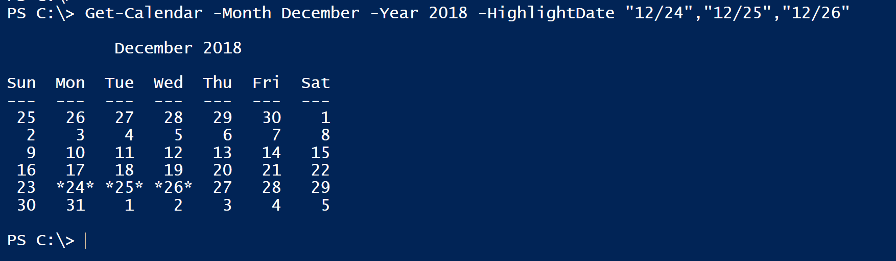
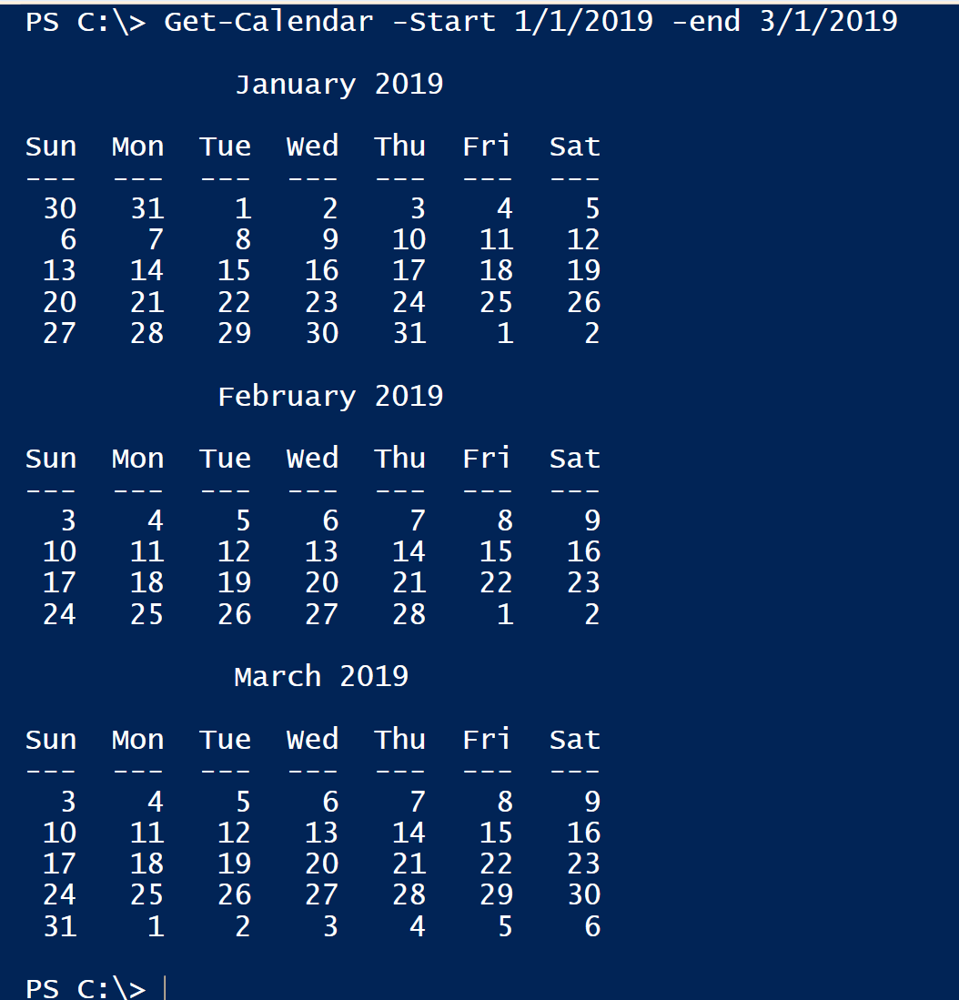
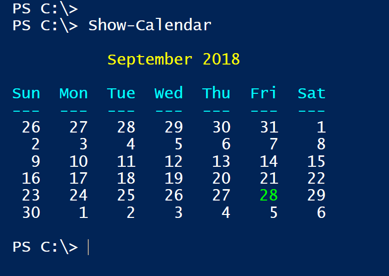
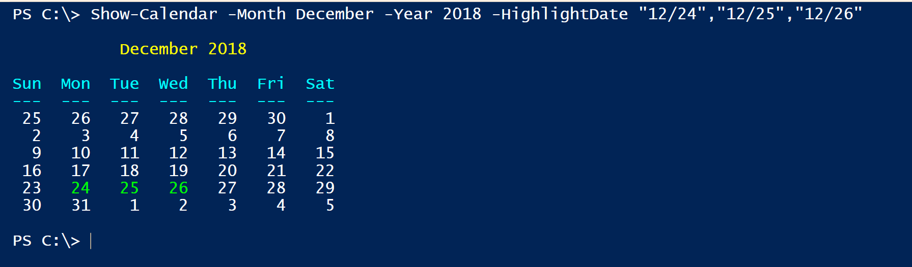
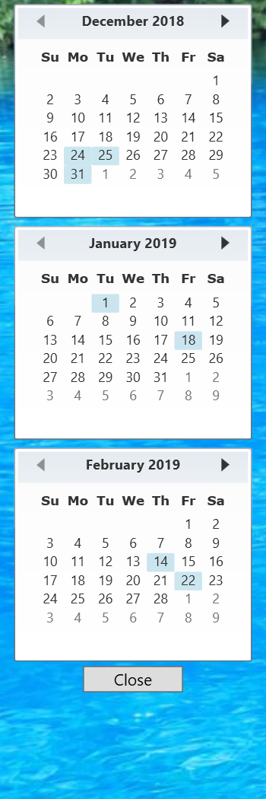

# PSCalendar

This module contains a few functions for displaying a calendar in the PowerShell console. The primary function is based on code originally published by Lee Holmes at http://www.leeholmes.com/blog/2008/12/03/showing-calendars-in-your-oof-messages/
.

You can install this module from the PowerShell Gallery.

```powershell
Install-Module PSCalendar
```

It has been tested on PowerShell Core both under Windows and Linux and there is no reason these commands should not work.

## Get-Calendar

The commands in this module have been updated to take advantage of new features in Windows PowerShell. The main function, [Get-Calendar](), will display the current month in the console, highlighting the current date with asterisks.


But you can also specify a calendar by month and year.



In this example you can see that I specified dates to highlight. Or you can specify a range of months.



The function should be culturally aware. The commands in this module that have a `-Month` parameter should autocomplete to culture specific month names.


There is a similar autocompletion for `-Year` that begins with the current year and then the next 5 years. Although nothing prevents you from entering any year you want.

## Show-Calendar

The module also contains a command to write a colorized version of the calendar to the console host. Whereas `Get-Calendar` writes a string to the pipeline, `Show-Calendar` writes directly to the host using `Write-Host`.



This command is in essence a "wrapper" function for `Get-Calendar`.



## Show-GUICalendar

Finally, you can display a graphical calendar using a WPF-based script. The function runs the calendar-related code in a runspace so it does not block your prompt. You can display up to 3 months and specify dates to highlight.

```powershell
PS C:\> Show-GuiCalendar 12/2018 2/2019 -highlight 12/24/18,12/25/18,12/31/18,1/1/19,1/18/19,2/14/19,2/22/19
```



The calendar form is transparent. But you should be able to click on it to drag it around your screen. You can also use the + and - keys to increase or decrease the calendar's opacity.

 *last updated 1 October 2018*
