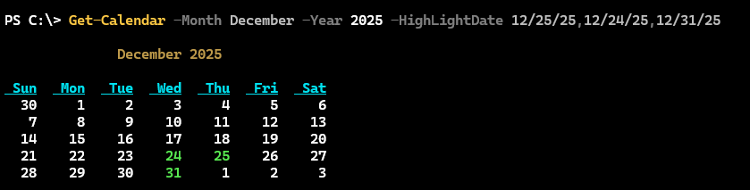
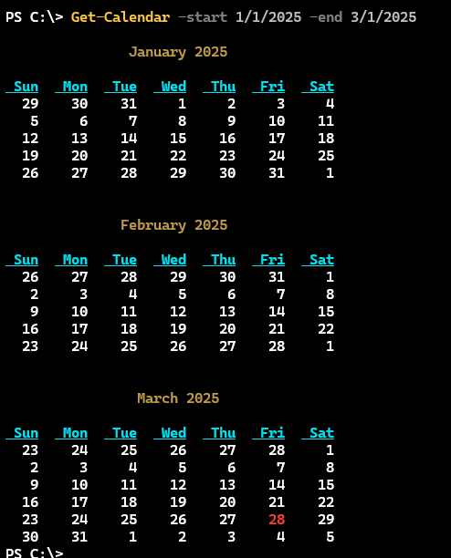
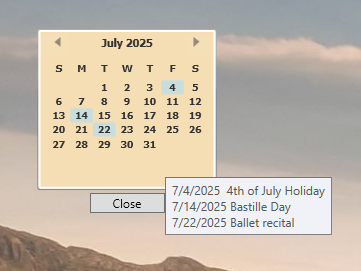

# PSCalendar Overview

[](https://www.powershellgallery.com/packages/PSCalendar/) [](https://www.powershellgallery.com/packages/PSCalendar/)

This module contains a few functions for displaying a calendar in the PowerShell console. The primary function is based on code originally published by Lee Holmes at [http://www.leeholmes.com/blog/2008/12/03/showing-calendars-in-your-oof-messages/](http://www.leeholmes.com/blog/2008/12/03/showing-calendars-in-your-oof-messages/). However, `v2.0.0` of this module contains a complete rewrite of the core functions.

## Installation

You can install this module from the PowerShell Gallery.

```powershell
Install-PSResource PSCalendar
```

> Installing this module will also install the `Microsoft.PowerShell.ThreadJob` module from the PowerShell Gallery, as that is module dependency if you want to use `Show-GuiCalendar`.

The commands in this module have been tested on PowerShell 7 both under Windows and Linux and there is no reason these commands should not work. Commands and aliases that are incompatible with non-Windows platforms will be handled on a per command basis.

After installing the module, you can view a local PDF version of this file by running `Show-PSCalendarHelp`.

__Note: If you are upgrading to v2.0.0 or later of this module, and have older versions installed, it is recommended that you uninstall the older versions.__

## Module Commands

| Name                        | Alias | Synopsis                                                   |
|-----------------------------|-------|-----------------------------------------------------------|
| [Export-PSCalendarConfiguration](docs/Export-PSCalendarConfiguration.md) | *Save-PSCalendarConfiguration*      | Save the current calendar configuration settings to a file. |
| [Get-Calendar](docs/Get-Calendar.md)                | *cal*   | Displays a visual representation of a calendar.           |
| [Get-MonthName](docs/Get-MonthName.md)              |  *mon*  | Get the list of month names.                              |
| [Get-NCalendar](docs/Get-NCalendar.md)              | *ncal*  | Display a Linux-style ncal calendar.                      |
| [Get-PSCalendarConfiguration](docs/Get-PSCalendarConfiguration.md) |       | Get the current PSCalendar ANSI configuration.            |
| [Set-PSCalendarConfiguration](docs/Set-PSCalendarConfiguration.md) |       | Modify the PSCalendar ANSI configuration.                 |
| [Show-Calendar](docs/Show-Calendar.md)              | *scal*  | Display a colorized calendar month in the console.         |
| [Show-GuiCalendar](docs/Show-GuiCalendar.md)        | *gcal*  | Display a WPF-based calendar.                             |
| [Show-PSCalendarHelp](docs/Show-PSCalendarHelp.md)  |       | Display a help PDF file for the PSCalendar module.        |

Here are a few details are the commands you are most likely to use.

### [Get-Calendar](docs/Get-Calendar.md)

The commands in this module have been updated to take advantage ANSI escape sequences. The main function, [Get-Calendar](docs/Get-Calendar.md), will display the current month in the console, highlighting the current date with an ANSI escape sequence.


But you can also specify a calendar by month and year.



In this example you can see that I specified dates to highlight. Or you can specify a range of months.



In v2.10.0 you can now specify a range of months by calendar quarter. The default is the current year.


The function should be culturally aware. The commands in this module that have a `-Month` parameter should autocomplete to culture-specific month names.


There is a similar autocompletion for `-Year` that begins with the current year and then the next 5 years. Although nothing prevents you from entering any year you want.

### [Show-Calendar](docs/Show-Calendar.md)

In previous versions of this module, there was a command called `Show-Calendar` which wrote a colorized version of the calendar to the host using `Write-Host`. This command has been rewritten and now is essentially a wrapper for `Get-Calendar`. The primary difference is that you can position the calendar with this command.

```powershell
$pos = [System.Management.Automation.Host.Coordinates]::new(72,0)
$h = "7/4/2025","7/14/2025"
Show-Calendar -HighLightDate $h -Position $pos -Month July
```


#### A Console Calendar Prompt

One way you might want to use this is in your PowerShell console. You can use the prompt function like this:

```powershell

#requires -modules "PSCalendar"

Function prompt {
  #define a buffercell fill
  $fill = [system.management.automation.host.buffercell]::new(" ",$host.UI.RawUI.BackgroundColor,$host.UI.RawUI.BackgroundColor,"complete")

  #define a rectangle with an upper left corner X distance from the edge
  $left =$host.UI.RawUI.WindowSize.width - 42

  #need to adjust positioning based on buffer size of the console
  #is the cursor beyond the window size, ie have we scrolled down?
    if ($host.UI.RawUI.CursorPosition.Y -gt $host.UI.RawUI.WindowSize.Height) {
        $top = $host.UI.RawUI.CursorPosition.Y - $host.UI.RawUI.WindowSize.Height
    }
    else {
        $top = 0
    }
  #    System.Management.Automation.Host.Rectangle new(int left, int top, int right, int bottom)
  $r = [System.Management.Automation.Host.Rectangle]::new($left, 0, $host.UI.RawUI.WindowSize.width,$top+10)

  #clear the area for the calendar display
  $host.UI.RawUI.SetBufferContents($r,$fill)

  #show the calendar in the upper right corner of the console
  $pos = [system.management.automation.host.coordinates]::new($left,0)
  Show-Calendar -Position $pos

  "PS $($executionContext.SessionState.Path.CurrentLocation)$('>' * ($nestedPromptLevel + 1)) ";

# .Link
# https://go.microsoft.com/fwlink/?LinkID=225750
# .ExternalHelp System.Management.Automation.dll-help.xml

}
```

Assuming the width of your console is at least 120, this code should work. Otherwise, you might need to tweak the positioning. This should also work in Windows Terminal. If you add some highlighted dates using `$PSDefaultParameterValues`, then you'll have a calendar right in front of you.


Note that any command output may be truncated because of the calendar display. This prompt function works as expected when using the Windows Terminal. Function needs work to behave as expected in a traditional PowerShell console where you might have a large buffer for scrolling.

### [Show-GuiCalendar](docs/Show-GuiCalendar)

Finally, you can display a graphical calendar using a Windows Presentation Foundation (WPF) based script.

> __This command is not supported on non-Windows platforms.__

The function runs the calendar-related code in a runspace so it does not block your prompt. You can display up to 3 months and specify dates to highlight.

```powershell
Show-GuiCalendar 12/2025 2/2026 -highlight 12/24/25,12/25/25,12/31/25,1/1/26,1/18/26,2/14/26,2/22/26
```


The calendar form is transparent. But you should be able to click on it to drag it around your screen. You can also use the `+` and `-` keys to increase or decrease the calendar's opacity. Be aware that if you close the PowerShell session that launched the calendar, the calendar too will close.

Beginning with module version 2.2.0 you can also customize the calendar background with an image:

```powershell
Show-GuiCalendar -BackgroundImage D:\images\blue-robot-ps-thumb3.png -Stretch Fill -FontWeight DemiBold
```


Or you can specify a color. You can specify a WPF brush color like Cornsilk or Wheat, or use a color code like `#FFF000`:

```powershell
Show-GuiCalendar -BackgroundColor "#FFF000"
```


On Windows platforms, the `-BackgroundColor` parameter will autocomplete the available brush colors.

### [Get-NCalendar](docs/Get-NCalendar.md)

The Linux world has an *ncal* command which displays the month in a vertical fashion. `Get-NCalendar` and its alias `ncal` work in a similar manner. The default is for the current month and year.


The current date will be highlighted unless you use `-HideHighlight`. You must use the full month name, although there is tab completion.

```dos
PS C:\> ncal July 2025
     July 2025
Sun     6 13 20 27
Mon     7 14 21 28
Tue  1  8 15 22 29
Wed  2  9 16 23 30
Thu  3 10 17 24 31
Fri     4 11 18 25
Sat     5 12 19 26
```

This command does not support date highlighting other than the current date. See below.

### [Get-MonthName](docs/Get-MonthName.md)

This simple command will list the full month names for the current culture.

```dos
PS C:\> Get-MonthName
January
February
March
April
May
June
July
August
September
October
November
December
```

You might use this to build a larger `ncal` listing.

```dos
PS C:\> Get-MonthName | Select-Object -first 3 | Get-NCalendar -Year 2025
    January 2025
Sun     5 12 19 26
Mon     6 13 20 27
Tue     7 14 21 28
Wed  1  8 15 22 29
Thu  2  9 16 23 30
Fri  3 10 17 24 31
Sat     4 11 18 25

   February 2025
Sun     2  9 16 23
Mon     3 10 17 24
Tue     4 11 18 25
Wed     5 12 19 26
Thu     6 13 20 27
Fri     7 14 21 28
Sat     1  8 15 22

     March 2025
Sun  2  9 16 23 30
Mon  3 10 17 24 31
Tue     4 11 18 25
Wed     5 12 19 26
Thu     6 13 20 27
Fri     7 14 21 28
Sat  1  8 15 22 29
```

## Highlight Dates with Notes

Beginning with v2.2.0, in addition to specifying an array of dates to highlight, you can also use a hashtable. The key should be the highlight date, and the value a brief description.

```powershell
$h = @{"7/4/2025"="4th of July Holiday";"7/14/2025"="Bastille Day";"7/22/2025"="Ballet recital"}
Show-GuiCalendar -Start 7/1/2025 -HighLightDate $h -BackgroundColor wheat -FontWeight Bold -Font Tahoma
```

When you pass a hashtable, you will get a tooltip popup when you hover the mouse over the month.



This function reqUIres the WPF-related assemblies. It should work in Windows PowerShell and PowerShell 7. You will receive a warning if any incompatibility is detected.

## Customizing the Calendar Appearance

Beginning with v2.0.0 of this module, ANSI escape sequences used to format the calendar are stored in module-scoped hashtable. You can use [Get-PSCalendarConfiguration](docs/Get-PSCalendarConfiguration.md) to view the current settings.


The output will show you the escape sequence appropriate for your PowerShell version. If you want to change a setting, you can use:

[Set-PSCalendarConfiguration](docs/Set-PSCalendarConfiguration.md)

You need to include the escape character but you do not need to include the closing escape sequence.


This change lasts for the duration of your PowerShell session. If you want to make it more permanent, you will need to add the commands to your PowerShell profile script.

Or you can use [`Export-PSCalendarConfiguration`](docs/Export-PSCalendarConfiguration.md) to save the settings to a file. This command was added in `v2.10.0`.

```dos
Export-PSCalendarConfiguration -passthru

        Directory: C:\Users\Jeff


Mode                LastWriteTime         Length Name
----                -------------         ------ ----
-a---         3/29/2025   2:51 PM            136   .pscalendarConfiguration.json
```

The export process will save your configurations settings to a JSON file in `$HOME`. When you import the module, if the file is found, the values will be imported and used in your PowerShell session. If you want to revert to the default settings, delete the JSON file, `$HOME\.pscalendarConfiguration.json`.

> If you uninstall the `PSCalendar` module, you will need to manually delete the JSON file.

## ANSI Support

As you've seen, there are several commands in this module that rely on ANSI for formatting. The hosting application needs to be able to recognize and use ANSI escape sequences. These commands should work in both Windows PowerShell and PowerShell 7 in the traditional PowerShell consoles or in Windows Terminal. They will not work in the PowerShell ISE. ANSI-related output will be automatically disabled if the PowerShell ISE is detected.

If you aren't sure if your host supports ANSI, run `Get-PSReadlineOption`. You should see something like this:


If you don't see color formatting, the hosting application doesn't support ANSI.

## A Note on Culture

I've tried very hard to make the commands respect culture. Most commands now that string values to represent dates which are then treated as dates internally. For this reason, it is important that you follow the culture-specific short date format that you get from running this command:

```powershell
(Get-Culture).DateTimeFormat.ShortDatePattern
```

In Windows PowerShell, all of the commands appear to respect culture settings. However, when running in PowerShell 7 there appears to be a bug in .NET Core and how it returns culture information for some cultures, specifically the first day of the week. If you run `Get-Calendar` or `Show-Calendar` and the week begins on the wrong day, use the `FirstDay` parameter to override the detected .NET values with the correct one.

```dos
PS C:\> Get-Calendar august -FirstDay Monday -highlight 1/8/2025,15,8,2025

                August 2025

 Mon   Tue   Wed   Thu   Fri   Sat   Sun
  26    27    28    29    30    31     1
   2     3     4     5     6     7     8
   9    10    11    12    13    14    15
  16    17    18    19    20    21    22
  23    24    25    26    27    28    29
  30    31     1     2     3     4
```

For example, if you are running under the `en-AU` culture, you would need to use this syntax.

## Integrating with PSReminderLite

You might be interested in integrating this module with the [PSReminderLite](https://github.com/jdhitsolutions/PSReminderLite) PowerShell module. The `PSReminderLite` module is a lightweight reminder system that uses a SQLite database.

```dos
PS C:\> Get-PSReminder -Tag Event

ID   Event                         Comment                               Date   Countdown
--   -----                         -------                               ----   ---------
1164 PowerShell Summit                                       4/7/2025 8:00 AM  8.16:53:32
1165 PowerShell Summit                                       4/8/2025 8:00 AM  9.16:53:32
1166 PowerShell Summit                                       4/9/2025 8:00 AM 10.16:53:32
1167 PowerShell Summit                                      4/10/2025 8:00 AM 11.16:53:32
1173 Workplace Ninjas UK                                    6/16/2025 9:00 AM 78.17:53:32
1174 Workplace Ninjas UK                                    6/17/2025 9:00 AM 79.17:53:32
```

I have configured my PowerShell profile to use PSReminder dates as highlighted dates in the calendar. In my PowerShell `prompt` function, I have this code:

```powershell
$days = (Get-PSReminder -All).Where({-Not $_.Expired}).Date.ToShortDateString() | Select-Object -Unique
$PSDefaultParameterValues.'*-*Calendar:HighlightDate' = $days
```

This ensures that I always have my upcoming reminders highlighted in the calendar without having to manually enter them.

```dos
PS C:\> $PSDefaultParameterValues.GetEnumerator() | where Name -match calendar

Name                           Value
----                           -----
*-*Calendar:HighlightDate      {4/1/2025, 4/2/2025, 4/7/2025, 4/8/2025…}
```


## Related Modules

You might also be interested in the [PSClock](https://github.com/jdhitsolutions/PSClock) module which displays a WPF-base clock on your desktop as well as [PSTimers](https://github.com/jdhitsolutions/PSTimers) which is a PowerShell module with a number of timer and countdown commands.

## Potential Issues

I have tried to make this module culture-aware. Testing across cultures is not an easy process. If you encounter a problem and are not running PowerShell under the `EN-US` culture, run the calendar command you are trying to use with `-Verbose` and post the results in a new issue. Or if you have both Windows PowerShell and PowerShell 7 installed, try the same command in both versions.

Please post any issues or feature requests in the module's [Issues.](https://github.com/jdhitsolutions/PSCalendar/issues)
